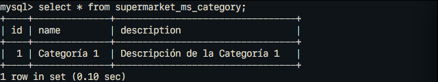

#### Universidad Nacional de Colombia
### Arquitectura de Software
## Laboratorio 2

- Julian David Acosta
- Luis Ferney Sandoval
- Juan Camilo Vargas

### 1. Descripción de la API-REST.

A continuación se encuentra la descripción de la API-REST, utilizando el formato de [Swagger](https://editor.swagger.io).

```yaml
swagger: "2.0"

info:
  description: "Supermarket es un a API que se conecta a una base de datos que se encarga de guardar la información de los productos de un supermercado"
  version: "1.0.0"
  title: "Supermarket Ms"
  
tags:
- name: "categories"
  description: "Operaciones relacionadas con las categorias disponibles en el supermercado"

- name: "products"
  description: "Operaciones relacionadas con los productos disponibles en el supermercado"
  
schemes:
- "http"

paths:

  /categories:

    get:
      tags:
      - "categories"
      summary: "Obteniene todas las categorias de productos disponibles en el supermercado"
      operationId: "getCategories"
      produces:
      - "application/json"
      responses:
        "200":
          description: "OK"
          schema:
            type: array
            items:
              $ref: "#/definitions/Category"
              
    post:
      tags:
      - "categories"
      summary: "Añade una nueva categoria de productos a la base de datos"
      operationId: "addCategory"
      consumes:
      - "application/json"
      produces:
      - "application/json"
      parameters:
      - in: "body"
        name: "body"
        description: "Datos de la categoria que se desea añadir a la base de datos"
        required: true
        schema:
          type: object
          required:
           - "name"
           - "description"
          properties:
            name:
              type: string
            description:
              type: string
      responses:
        "201":
          description: "Created"
          schema:
            $ref: "#/definitions/Category"
        "400":
          description: "Bad Request"
          schema:
            type: object
            properties:
              name:
                type: array
                items:
                  type: string
              description:
                type: array
                items:
                  type: string
              
  /categories/{id}:
  
    get:
      tags:
      - "categories"
      summary: "Busca una categoria por su id en la base de datos del supermercado"
      operationId: "findCategoryById"
      produces:
      - "application/json"
      parameters:
      - name: "id"
        in: "path"
        description: "Id de la categoria que se quiere buscar en la base de datos"
        required: true
        type: "integer"
        format: "int64"
      responses:
        "200":
          description: "OK"
          schema:
            $ref: "#/definitions/Category"
        "404":
          description: "Not Found"
          schema:
           type: object
           properties:
            detail:
              type: string

    put:
      tags:
      - "categories"
      summary: "Actualiza alguna categoria existente en la base de datos del supermercado"
      operationId: "updateCategory"
      produces:
      - "application/json"
      parameters:
      - name: "id"
        in: "path"
        description: "Id de la categoria que se quiere actualizar en la base de datos"
        required: true
        type: "integer"
        format: "int64"
      - in: "body"
        name: "body"
        description: "Datos a actualizar en la categoria indicada"
        required: true
        schema:
          type: object
          required:
           - "name"
           - "description"
          properties:
            name:
              type: string
            description:
              type: string
      responses:
        "200":
          description: "OK"
          schema:
            $ref: "#/definitions/Category"
        "400":
          description: "Bad Request"
          schema:
            type: object
            properties:
              name:
                type: array
                items:
                  type: string
              description:
                type: array
                items:
                  type: string
        "404":
          description: "Not Found"
          schema:
           type: object
           properties:
            detail:
              type: string

    delete:
      tags:
      - "categories"
      summary: "Borrar una categoria existente en la base de datos del supermercado"
      operationId: "deleteCategory"
      parameters:
      - name: "id"
        in: "path"
        description: "Id de la categoria que se quiere eliminar en la base de datos"
        required: true
        type: "integer"
        format: "int64"
      responses:
        "204":
          description: "No Content"
        "404":
          description: "Not Found"
          schema:
           type: object
           properties:
            detail:
              type: string


  /products:
  
    get:
      tags:
      - "products"
      summary: "Obteniene todos los productos disponibles en el supermercado"
      operationId: "getProducts"
      produces:
      - "application/json"
      responses:
        "200":
          description: "OK"
          schema:
            type: array
            items:
              $ref: '#/definitions/Product'
  
    post:
      tags:
      - "products"
      summary: "Añade un nuevo producto a la base de datos del supermercado"
      operationId: "addProduct"
      consumes:
      - "application/json"
      produces:
      - "application/json"
      parameters:
      - in: "body"
        name: "body"
        description: "Datos de la categoria que se desea añadir a la base de datos"
        required: true
        schema:
          type: object
          properties:
            name:
              type: string
            description:
              type: string
            category:
              $ref: "#/definitions/Category"
            unit_measurement:
              type: string
              enum:
              - "Units"
              - "Liters"
              - "Grams"
            quantity:
              type: integer
      responses:
        "201":
          description: "Created"
          schema:
            $ref: '#/definitions/Product'
        "400":
          description: "Bad Request"
          schema:
            type: object
            properties:
              name:
                type: array
                items:
                  type: string
              description:
                type: array
                items:
                  type: string
              category:
                type: array
                items:
                  type: string
              unit_measurement:
                type: array
                items:
                  type: string
              quantity:
                type: array
                items:
                  type: string
              
  /products/{id}:
  
    get:
      tags:
      - "products"
      summary: "Busca un producto por su id en la base de datos del supermercado"
      operationId: "findProductById"
      produces:
      - "application/json"
      parameters:
      - name: "id"
        in: "path"
        description: "Id del producto que se quiere buscar en la base de datos"
        required: true
        type: "integer"
        format: "int64"
      responses:
        "200":
          description: "OK"
          schema:
            $ref: '#/definitions/Product'
        "404":
          description: "Not Found"
          schema:
           type: object
           properties:
            detail:
              type: string

    put:
      tags:
      - "products"
      summary: "Actualiza algun producto existente en la base de datos del supermercado"
      operationId: "updateProduct"
      produces:
      - "application/json"
      parameters:
      - name: "id"
        in: "path"
        description: "Id del producto que se quiere actualizar en la base de datos"
        required: true
        type: "integer"
        format: "int64"
      - in: "body"
        name: "body"
        description: "Datos a actualizar en el producto indicado"
        required: true
        schema:
          type: object
          properties:
            name:
              type: string
            description:
              type: string
            category:
              $ref: "#/definitions/Category"
            unit_measurement:
              type: string
              enum:
              - "Units"
              - "Liters"
              - "Grams"
            quantity:
              type: integer
      responses:
        "200":
          description: "OK"
          schema:
            $ref: "#/definitions/Product"
        "400":
          description: "Bad Request"
          schema:
            type: object
            properties:
              name:
                type: array
                items:
                  type: string
              description:
                type: array
                items:
                  type: string
              category:
                type: array
                items:
                  type: string
              unit_measurement:
                type: array
                items:
                  type: string
              quantity:
                type: array
                items:
                  type: string
        "404":
          description: "Not Found"
          schema:
           type: object
           properties:
            detail:
              type: string

    delete:
      tags:
      - "products"
      summary: "Borrar un producto existente en la base de datos del supermercado"
      operationId: "deleteProduct"
      parameters:
      - name: "id"
        in: "path"
        description: "Id del producto que se quiere eliminar en la base de datos"
        required: true
        type: "integer"
        format: "int64"
      responses:
        "204":
          description: "No Content"
        "404":
          description: "Not Found"
          schema:
           type: object
           properties:
            detail:
              type: string


definitions:

  Category:
    type: "object"
    required:
    - "name"
    - "description"
    properties:
      id:
        type: "integer"
        format: "int64"
      name:
        type: "string"
        maxLength: 20
      description:
        type: "string"
        maxLength: 140
  
  Product:
    type: "object"
    required:
    - "id"
    properties:
      id:
        type: "integer"
        format: "int64"
      name:
        type: "string"
        maxLength: 20
      description:
        type: "string"
        maxLength: 140
      category:
        $ref: "#/definitions/Category"
      unit_measurement:
        type: "string"
        enum:
        - "Units"
        - "Liters"
        - "Grams"
      quantity:
        type: "integer"
        format: "int64"
```

### 2. Soporte visual de la ejecución de las peticiones HTTP sobre la API-REST.

El microservicio expone 10 operaciones en total. A continuación mostramos la ejecución de cada una de estas en el servidor.

#### Operaciones de Categorías:

```
POST /categories
```

```
GET /categories
```

```
GET /categories/id
```

```
PUT /categories/id
```

```
DELETE /categories/id
```


#### Operaciones de Productos:

```
POST /products
```

```
GET /products
```

```
GET /products/id
```

```
PUT /products/id
```

```
DELETE /products/id
```


### 3. Soporte visual de las acciones evidenciadas en la base de datos, tras la ejecución de las peticiones sobre la API-REST.


#### Operaciones de Categorías:

Observamos los contenidos iniciales de la tabla `supermarket_ms_category`:


```
POST /categories
```

```
PUT /categories/id
```

```
DELETE /categories/id
```


#### Operaciones de Productos:

Observamos los contenidos iniciales de la tabla `supermarket_ms_product`:


```
POST /products
```

```
PUT /products/id
```

```
DELETE /products/id
```


### 4. Vista de C&C de la arquitectura identificada.
