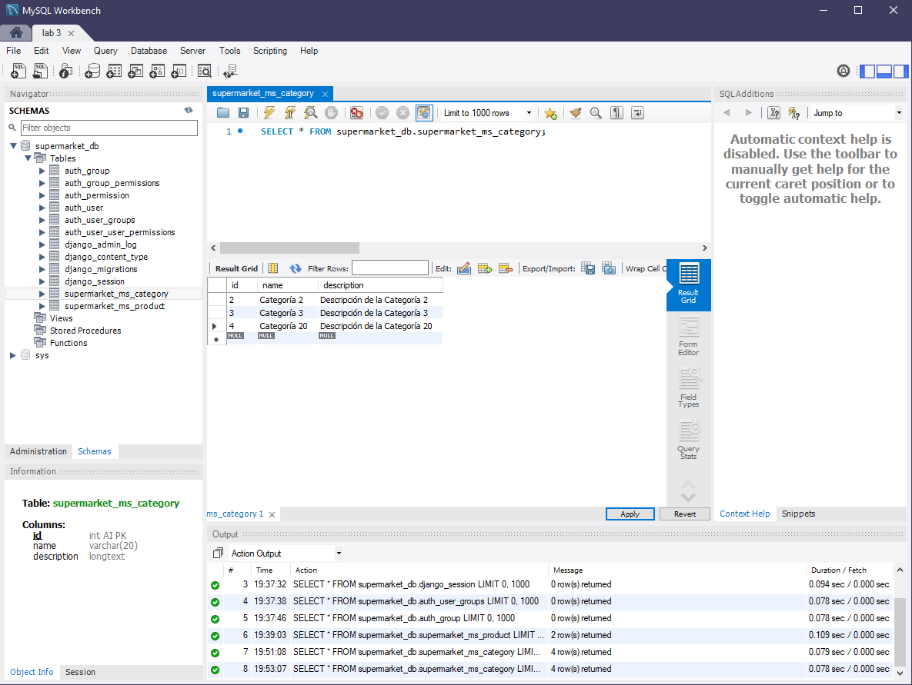
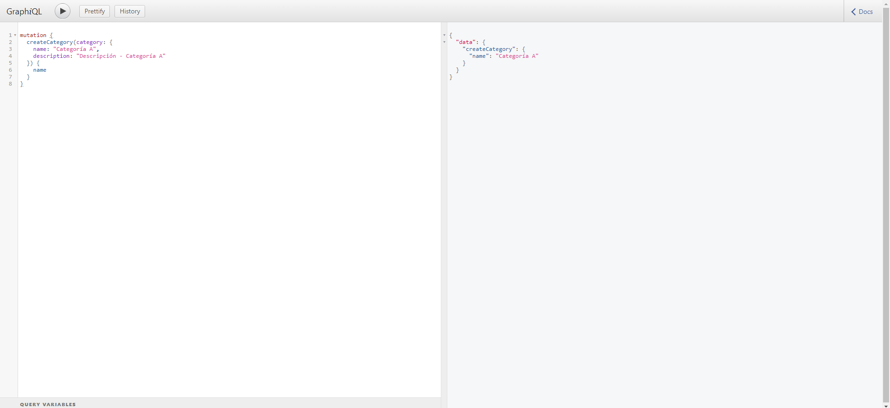
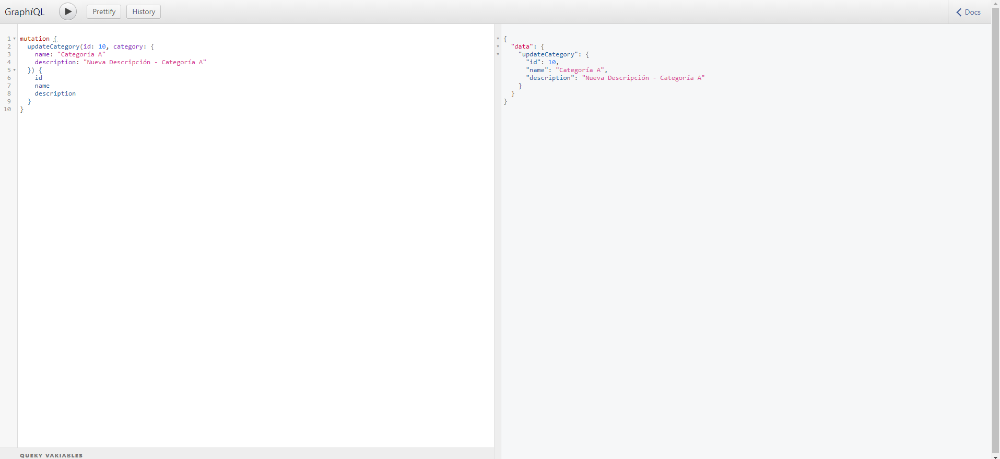
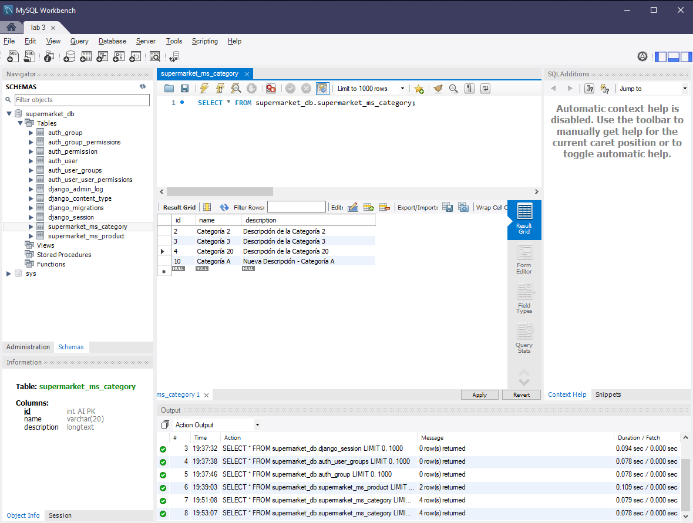
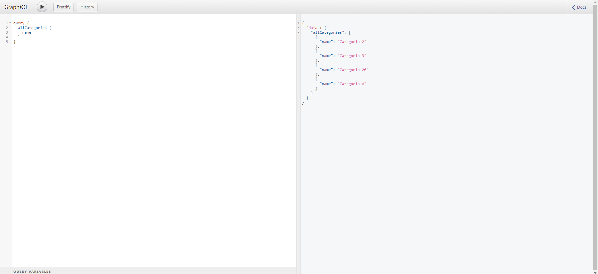
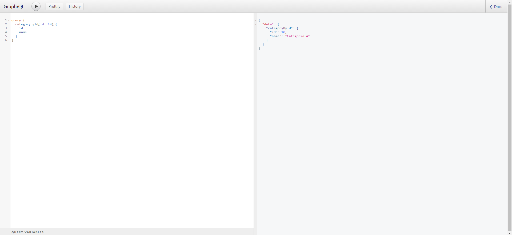
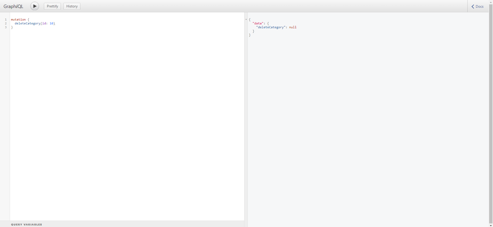

#### Universidad Nacional de Colombia
### Arquitectura de Software
## Laboratorio 3

- Julian David Acosta
- Luis Ferney Sandoval
- Juan Camilo Vargas

### 1. Soporte visual de la ejecución de las peticiones sobre la API-GraphQL, y sus acciones evidenciadas en la base de datos.

A continuación se encuentran el soporte visual de cada una de las peticiones y la evidencia de su acción en la base datos, en los casos pertinentes.
Estado inicial de la base de datos:


#### Crear una categoria:

```
mutation {
  createCategory(category: {
    name: "Categoría A",
    description: "Descripción - Categoría A"
  }) {
    name
  }
}
```
Ejecución de la petición:


Base de datos luego de realizar la petición:


#### Actualizar una categoria:

```
mutation {
  updateCategory(id: 10, category: {
    name: "Categoría A"
    description: "Nueva Descripción - Categoría A"
  }) {
    id
    name
    description
  }
}
```
Ejecución de la petición:


Base de datos luego de realizar la petición:


#### Consultar los nombres de todas las categorías:

```
query {
  allCategories {
    name
  }
}
```
Ejecución de la petición:


#### Consultar el id y nombre de una categoria:

```
query {
  categoryById(id: 10) {
    id
    name
  }
}

```
Ejecución de la petición:


#### Eliminar una categoria:

```
mutation {
  deleteCategory(id: 10)
}

```
Ejecución de la petición:


Base de datos luego de realizar la petición:


