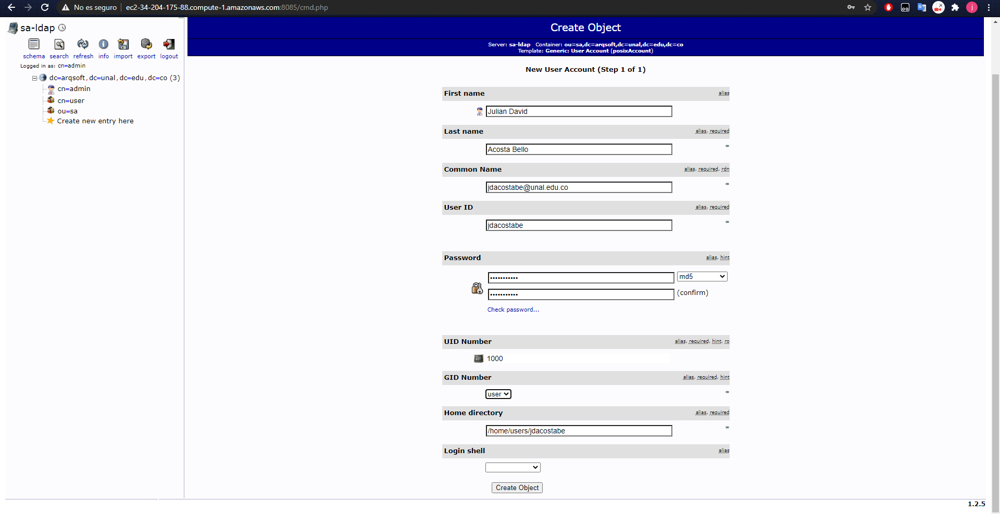

#### Universidad Nacional de Colombia
### Arquitectura de Software
## Laboratorio 5

- Julian David Acosta
- Luis Ferney Sandoval
- Juan Camilo Vargas

### 1. Soporte visual del despliegue del Servidor LDAP y configuración del directorio interno.

A continuación se encuentran el soporte visual del despliegue del servidor LDAP y de la configuración de su directorio interno
Despliegue del servidor LDAP y del gestor gráfico (phpLDAPadmin):

#### Configuración del directorio interno:

Apertura del gestor gráfico:

Autenticación como administrador:

Creación de grupo Posix:

Creación de unidad organizacional:

Creación de usuario en la unidad organizacional:

### 2. Soporte visual del despliegue y uso del componente Proxy Inverso.
Despliegue del componente Proxy Inverso:

Uso del componente Proxy Inverso:

