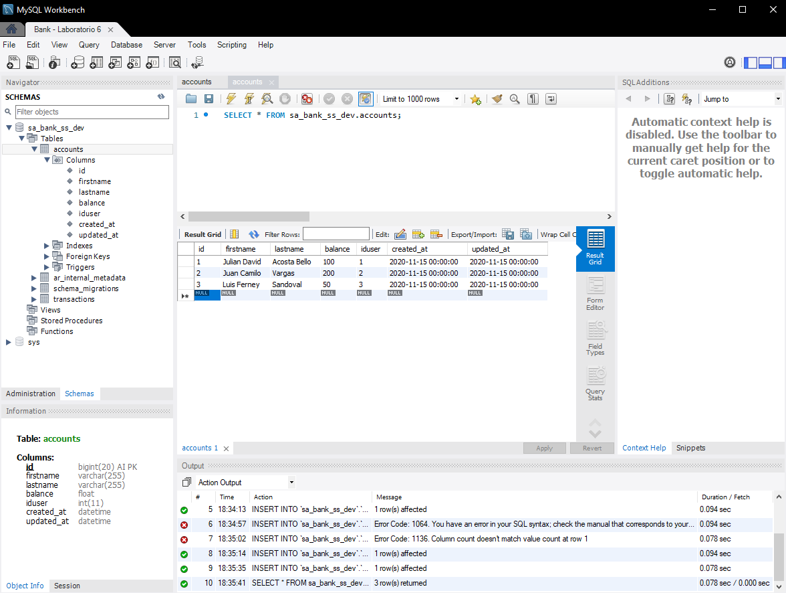
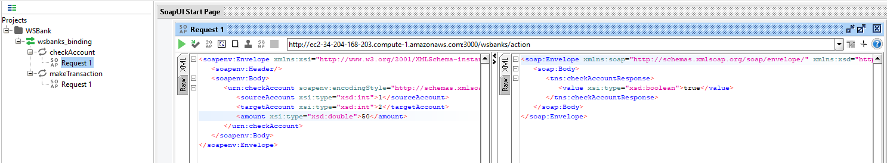
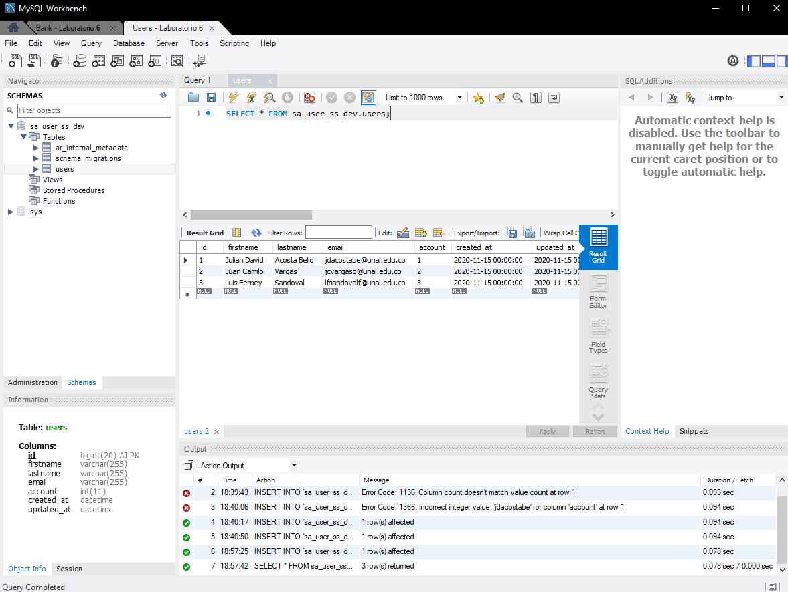
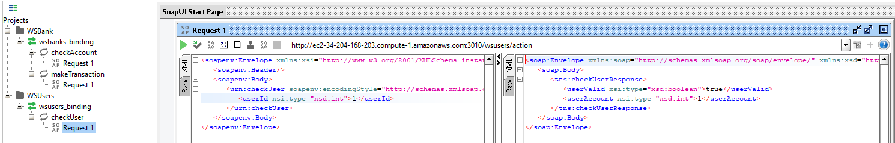
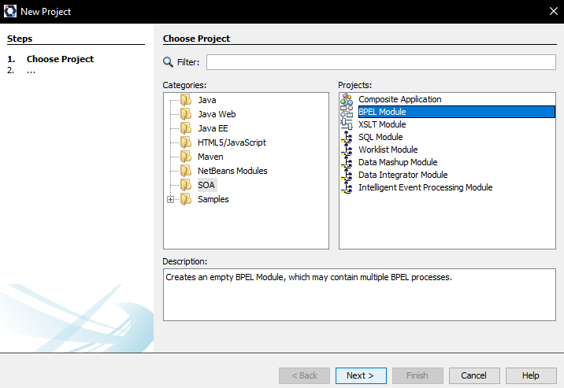
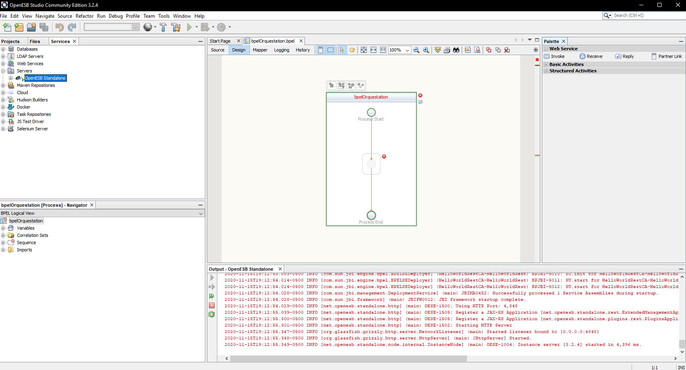
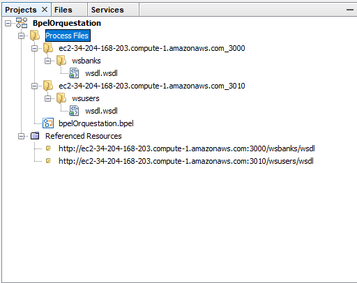
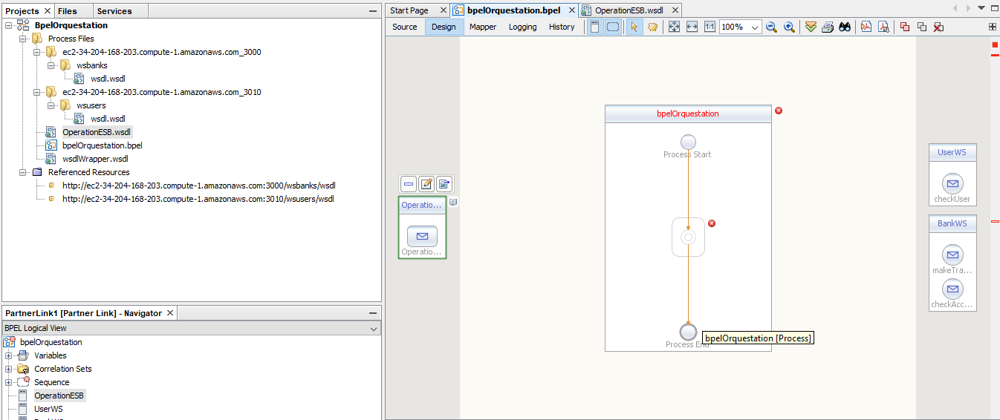
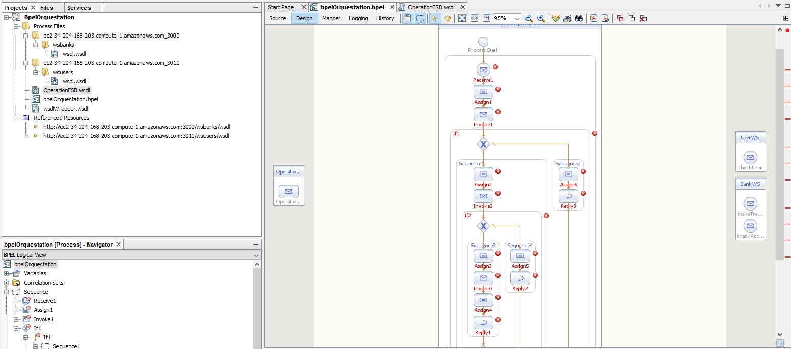
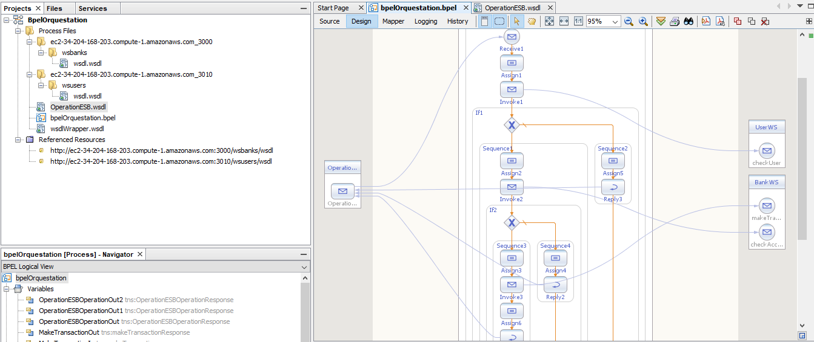

#### Universidad Nacional de Colombia
### Arquitectura de Software
## Laboratorio 6

- Julian David Acosta
- Luis Ferney Sandoval
- Juan Camilo Vargas

### 1. Despliegue de Servicios web.

Se despliegan las instancias sa_user_ss y sa_bank_ss en la instancia de AWS

Luego, se realiza la verificación del consumo de los servicios web:
#### sa_bank_ss:

#### sa_user_ss:

### 2. Creación y configuración del Bus Empresarial de Servicios.

Se crea el modulo BPEL, añade el servidor de openESB y se inicia

Se añaden las conexiones a los microservicios

Se crea el documento WSDL y se le añaden las conexiones previamente realizadas

Se realiza el flujo de operaciones que debe ejecutar el modulo BPEL, y posteriormente se configura

