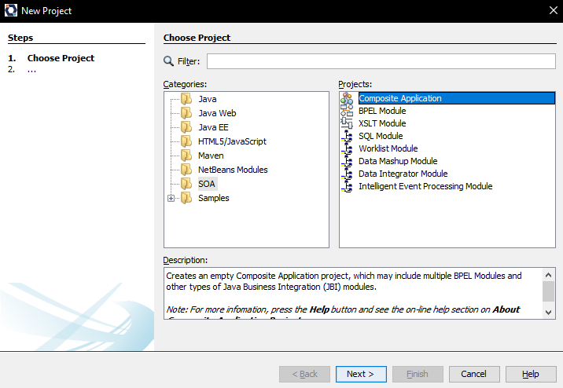

#### Universidad Nacional de Colombia
### Arquitectura de Software
## Laboratorio 6

- Julian David Acosta
- Luis Ferney Sandoval
- Juan Camilo Vargas

### 1. Despliegue de Servicios web.

Se despliegan las instancias sa_user_ss y sa_bank_ss en la instancia de AWS

Luego, se realiza la verificación del consumo de los servicios web:
#### sa_bank_ss:

#### sa_user_ss:

### 2. Creación y configuración del Bus Empresarial de Servicios.

Se crea el modulo BPEL, añade el servidor de openESB y se inicia

Se añaden las conexiones a los microservicios

Se crea el documento WSDL y se le añaden las conexiones previamente realizadas

Se realiza el flujo de operaciones que debe ejecutar el modulo BPEL, se configura y posteriormente se hace el build

### 3. Despliegue del bus de servicios

Ahora se crea la composite application, y se añade el modulo BPEL a la composite application

Finalmente hacemos el build, y desplegamos

Y probamos que el servidor está funcionando correctamente

### 4. Comprobación de la interoperabilidad

Se verifica que hayan datos en las bases de datos de cada uno de los microservicios

Posteriormente, se crea el proyecto SOAP para comprobar el funcionamiento del bus de servicios

Finalmente, realizamos la transacción entre dos usuarios por una cantidad de 600, y comprobamos que la operación se haya realizado en las bases de datos

