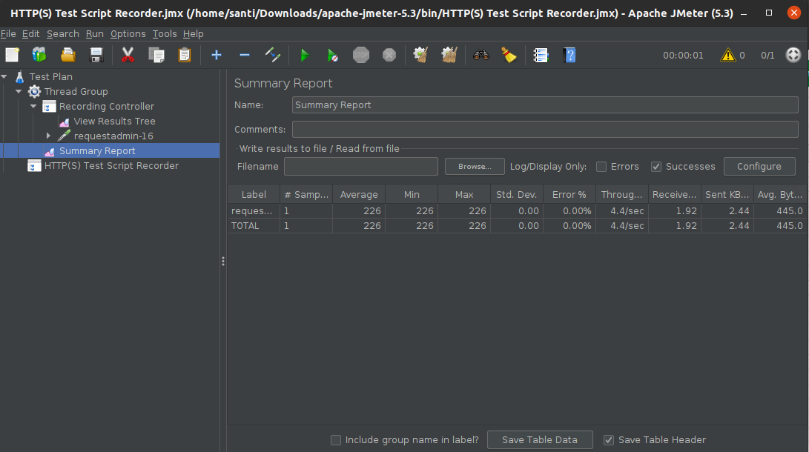
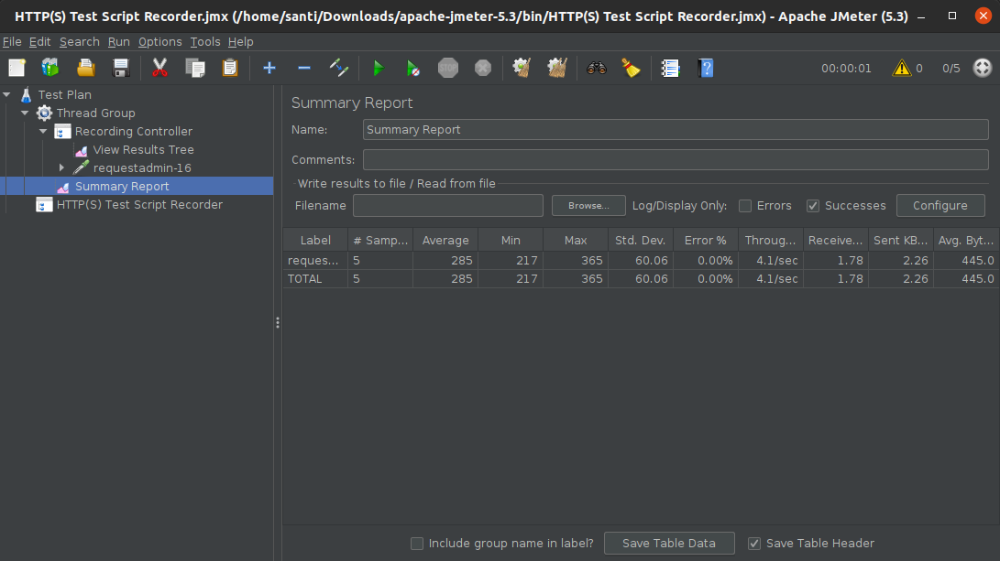
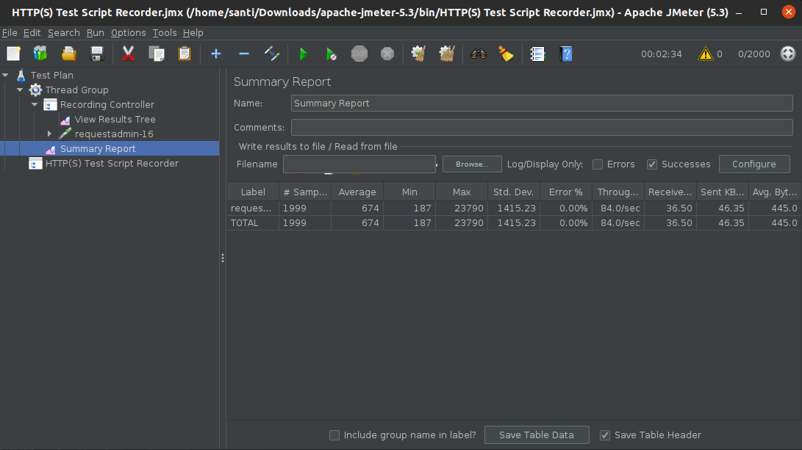

#### Universidad Nacional de Colombia
### Arquitectura de Software
## Laboratorio 8 - Grupo 2E

- Julian David Acosta
- Luis Ferney Sandoval
- Juan Camilo Vargas
- Francisco Javier Bernal
- Santiago Duque Bernal
- Santiago Hernández Montano
- Santiago Alejandro Morales

### 1. Soporte visual del la configración y uso del entorno de pruebas

- En Test Plan, agregar un nuevo Thread Group:
  
- En Test Plan, añadir un nuevo HTTP(s) Test Script Recorder:
  
- Configurar el HTTP(s) Test Script Recorder añadido: 
  
- Iniciar el proceso de grabación en JMeter (Start):\
  En Summary Report observar los resultados de la prueba realizada. Tener en cuenta el tiempo de respuesta.
  

#### Soporte visual de las actividades realizadas durante el desarrollo del Escenario 1

* Usuarios = 1
  
* Usuarios = 5
  
* Usuarios = 50
  
* Usuarios = 75
  
* Usuarios = 100
  
* Usuarios = 500
  
* Usuarios = 750
  
* Usuarios = 1000
  
* Usuarios = 2000
  

#### Soporte visual de las actividades realizadas durante el desarrollo del Escenario 2

* Usuarios = 1
  
* Usuarios = 5
  
* Usuarios = 50
  
* Usuarios = 75
  
* Usuarios = 100
  
* Usuarios = 500
  
* Usuarios = 750
  
* Usuarios = 1000
  
* Usuarios = 2000
  

#### Tabla y gráfica de rendimiento usando los datos obtenidos en los pasos anteriores, donde se evidencie la curva de rendimiento  para cada uno de los dos escenarios probados

Realizando cada prueba un total de 3 veces, y promediando los resultados de 'Tiempo de Respuesta' obtenidos logramos completar la siguiente tabla:
  

En la siguiente gráfica podemos comparar los resultados obtenidos con cada escenario de prueba:
  

#### Conclusiones

Al observar los resultados obtenidos, a pesar de tener ciertos datos en el **escenario 1** que salen de la tendencia trazada por los puntos obtenidos en las demas pruebas, podemos ver el desempeño significativamente mejor que permite el escalamiento del **escenario 2**.
Entre mayor el número de usuarios concurrentes simulados dentro del sistema, el desempeño del **escenario 2** resulta relativamente mejor al observado sin escalamiento en el **escenario 1**.
De igual forma, vemos que el sistema puede dar una buena respuesta al número de usuarios planteados, ya que dentro del rango de usuarios simulados, no se alcanzan a percibir pérdidas en la respuesta del sistema.
La gráfica obtenida nos muestra que con este rango no se alzanza la rodilla de la curva de rendimiento, es necesario realizar la prueba de carga dentro de un rango de usuarios mayor para determinar su ubicación exacta.

